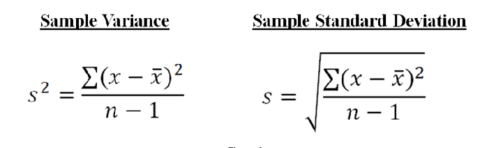

# DATA ENGINEERING

##### 28/07/2021

### AWS s3

1. Max file size 5TB
2. Allows any file type to store
3. Common ML data file formats - csv, json, protobuf, orc, avro, parquet
4. Data **partitioning** techniques - by date, by product, athena (serverless), Kinesis or Glue (does partinioning for us)
5. 5 types of s3 **creation**. The more we move towards the less cost it induces. We can also create rules for transitioning from one type of bucket to another. This can be done under Manage bucket section.
6. **Encryption** - 4 types of encrytion sse-s3, sse-kms, sse-c, client-side encyption. For Ml we mostly use sse-3 and sse-kms
7. **SSE-3** - (Server SIde Encryption-3) When we store object to s3, s3 generated a key and attaches it to our data.
8. **SSE-KMS** - (Server Side Encrytion Key Management Service CMK (Customer Master Key)) When we store object to s3, KMS-CMK creates encryption which we can manage from our end. This provides more security
9. For more security, define policies fro accessing bucket. 2 ways - User based - IAM policy (json), Resource based policy - bucket policy, object acl, bucket acl
10. bucket policy - very commonly used to grant cross account access
11. Other security topiccs -
    1. Security via - **VPC** Endpoint gateway - usually when vpc is not configured, all our data goes through public network to read/write s3
    2. If VPC configured, it creates a private network for such reads/writes.
    3. **Note** - check resources like sagemaker to access s3 in such a private network.
    4. Security via AWS event logging and audit is done by **Cloudtrail**
    5. Security via **Tagging** s3 object via properties with Classification=PHI (Personal Health Information). Onlu right bucket policy or IAM policy can access such objects.
12. **TODO - create a bucket with above features**

### AWS Kinesis

##### 29/07/2021 - 02/08/2021

1. Kinesis is a streaming servicce, an alternative to Apache Kafka
2. Compatible with stream processing framework like Spark, NiFi, etc
3. Data is by default replicated to 3 regions, so it is highly safe
4. **Exam Que** - Diff between - Streams, Analystics, Firehose, Video Streams
   1. Kinesis Stream

      1. realtime, low latency streaming ingest
      2. Streams are divided into Shards/Partitions
      3. Hards need to be provisioned in advance
      4. Data rention 24hrs by default, can be extended to 7 days
      5. Due to above point, it provides playback or replay feature; also multiple apps can use same stream
      6. Records can be upto 1MB size
      7. Data cannot be deleted once inserted to Kinesis
      8. Limitations -
         1. Producer - 1MB/s or 1000 messages/s write per shard is allowed, above that you get error 'ProvisionThroughputException'
         2. Consumer - 2MB/s read per shard or 5api calls/s per shard\
         3. Higher the no. of Shards, greater the capacity and speed. Hence KS only scales when we add shards over time
   2. Kinesis Analytics -

      1. realtime analytics (ETL - Extract,Transform,Load) of streams using SQL or Flink
      2. generate metrics in realtime, ex-games like ludo
      3. responsive analytics - realtime analysis based on certain criteria/input and filtering
      4. only pay for resource consumed (but it's not cheap)
      5. we can use IAM permissions
      6. serverless, scales automatically
      7. lambda can be used for data processing
      8. schema discovery
      9. **Machine Learning on KA**
         1. Random Cut Forest - anomaly detection on numeric columns, uses only recent data, hence model changes overtime. Ex- detect anomalies in webapp requests
         2. Hotspots - locates and returs information about dense region in our data. Less changing model. Ex- locate time in a day where max requests are made to an app
   3. Kinesis Firehose -

      1. Load data in s3, Redshift, ElasticSearch, Splunk
      2. Fully managed service, no need of administration
      3. Near realtime, 60sec latency minimum
      4. Automatic scaling
      5. Store data in any format
      6. Data Conversion and suppresssion allowed (zip, gzip etc) only for s3
      7. Data Transformation allowed only for lambda
   4. Diff bet Kinesis Streams and Kinesis Firehose

      1. KS latency 70-300ms, custom code for producer and consumer, real time applications, storage 1-7days, replay capability, multiple consumers, manual scaling (high throughput - shard splitting, less throughput - shard merging)
      2. KF is ingestion service, full managed, send data to (s3, redshift, elasticsearch, splunk), serverless data tansformation to lambda, near real-time, automated scaling, no data source hence no replay
   5. Kinesis Video Streams -

      1. streaming video real time
      2. one producer per video stream. producer example - security camera, body-worn camera, AWS deeplens, smartphone camera
      3. consumer example - AWS sagemaker, our own algorithm like mxnet or tf, AWS rekognition
      4. Data storage 1-10yrs
5. Architecture - KS takes all data from IOT devices, metric logs, etc OR KF stores them to Redshift, s3, etc for deeper analytics, reporting etc --> KA analyzes data stored by KS or KF
6. **Summary** - check kinesis.png

### AWS Glue

##### 29/07/2021 - 02/08/2021

1. **Glue Data Catalog**
   1. is a metadata repository for all the tables in your account
   2. Schemas are automatically created, schemas are versioned
   3. Integrated with athena, redshift, etc
2. **Glue crawlers**
   1. crawl through all your databases like dynamodb, s3, etc
   2. infers schemas and partitions
   3. works for json, parquet, csv, etc
   4. we can run crawler on demand or on schedule
   5. Based on how we will query s3 bucket, store data according beforehand.
3. **Glue ETL**
   1. Extract, Transform and Load, ETL allows you to clean data before analysis
   2. Target can be RDS, glue data catalog, s3
   3. Generate ETL code in python or spark
   4. Fully managed, cost effective, pay only for resources used
   5. Jobs are run on serverless spark platform
   6. Glue scheduler is used to schedule jobs
   7. Glue triggers are used to automate job runs based on event
   8. **Transformations** - Glue ETL is used for transforming data. Transformation can be applied via -
      1. **Bundled Transformations**
         1. DropFields, DropNullFields - dropping null fields
         2. Filter - filtering as per some criteria
         3. join - join data
         4. map - add or delete fields, perform external lookups
      2. **Machine Learnig Transformations**
         1. FindMatches ML - Find duplicate data even if the data are not perfectly matching
      3. Format conversions - csv, json, orc, parquet, xml
      4. Apache spark transformations (ex- k-means)

### AWS Athena

##### 05/08/2021

1. Querying tool for s3
2. Requirement - s3 data should be available in AWS glue in the form of tables

### AWS Datastores

1. Redshift -
   1. datawareshouse technology
   2. massively parallel sql queries to run, then use Redshift. (OLAP - Online Analytical Processing)
   3. load data from s3 OR query it from s3 using redshift spectrum
   4. provision servers in advance
   5. Data is organized in columns or tables
   6. main purpose is to do analytics
2. RDS and Aurora-
   1. These are relational datastores
   2. OLTP - Online Transaction Processing
   3. provision servers in advance
   4. Data is orgainized in row
   5. main purpose is to to store data
3. Dynamodb -
   1. NoSDL - NotOnlySQL (some systems stores sql plus document data) or Not SQL (not sql only document data is stores)
   2. Useful to store ml outputs
   3. serverless
   4. provisioned read/write capacity
4. s3 -
   1. object storage
   2. serverless
   3. infite storage
   4. integration with almost all aws services
5. elastic search -
   1. indexing of data
   2. provision in advance
   3. search among data points
   4. useful for analytics
6. elastic cache
   1. cahing mechanism

### AWS Data pipelines

1. ETL sesrvice
2. move data from one source to other
3. integration with Redshift, RDS, s3, Dynamodb, EMR
4. manage task dependency
5. retries and notifies on failure
6. highly available service

### AWS Batch

##### 06/08/2021

1. Runs job as docker images
2. Used for performing computational or etl or any kind of job in batches
3. No need of provisioning from user. Dynamically provisioned
4. All resources like ec2 are dynamically created as per the job
5. User does not have to manage clusters, it is serverless
6. Schedule batch jobs using cloudwatch or prchestrate batch jobs using AWS step functions

### AWS Database Migration Service

1. Used for migrating database safely
2. service runs on ec2 instance
3. It will just replicate the data from source to destination
4. Source database will remain accessible while the migration service is running and also afterwards
5. Homogenous migration - oracle to oracle
6. Heterogenous migration - microsoft server to aurora

### AWS Step Function

1. Used for visualizing all the steps to perform inyour application
2. It will show you flowchart with knowledge of which aws service to use at which point in building your ML application
3. Used to design workflows
4. advanced error handling and retry mechanism out of the code
5. audit of the history of workflows
6. ability to wait for an arbitary amount of time
7. Max execution time of state machine is 1 year

# EXPLORATORY DATA ANALYSIS

##### 07/08/2021

### Pandas

1. A library to load, analyze and help clean the data
2. Deals in dataframes(2D like table) and series(1D like array)
3. Ex - **df['country'].value_counts()** - gives name of country and it's total count in the data
4. Ex - df = pd.read_csv('temp.txt', na_values=[''])
5. Ex- **df.describe()**
6. Interoperates with numpy. Mostly the data is given in terms of numpy arrays to train or predict. Ex - **df['query'].values() return numpy query data**

### Matplotlib

1. Used for showcasing the outputs in charts and graphs
2. **Seaborn** lib is built over matplotlib, better to use now a days
3. Heatmap, Jointmap

### Scikit learn

### Jupyter Notebook

### Keras

1. Keras has a way to convert keras model into scikitlearn model and then train the data
2. This is done so that we can use scikitlearns cross_val_score()
   1. cross_val_score() randomly separates our data into train and validation
   2. Above step is done multiple times with param cv.

### Types of Data

1. **Numerical**
   1. numbers or integers like age, stock price, no. of requests on webpage
   2. Types -
      1. **Discrete** - no. of purchases made by me in a year, no. of attacks I got on my website this month
      2. **Continuous** - rainfall
2. **Categorical**
   1. yes or no, fruit classes
   2. Often one class has no corelation with other class. Like we cannot say apply is better/sweeter than orange. They are not comparable in that sense.
   3. Often this is converted into numerical in machine learning applications
3. **Ordinal**
   1. Mixture of of categorical and numerical
   2. Ex - star ratings (1-5 are numerical categories), also these numbers have corelation. Like 5 is better than 4.

### Data Distributions

1. Normal Distribution - continuous data
2. poisson distribution has Probability Mass Funciton - discrete data
3. Binomial Distribution - discrete data
   1. Distrbute data in such a way where the results is from only 2 case
   2. Ex - coin toss
4. Bernouli Distribution - discrete data
   1. Special case of Binomial distribution, consists of single trial
   2. Ex - coint toss only once
   3. Hence Binomial distribution can be considered as the collection of Bernouli distribution

### Time series analysis

1. Siries of datapoints over time
2. discrete samples taken over dicrete point of time
3. Seasonality - its a feature in your data that shows changes as per seasons
4. Trends - its a feature in your data that shows patterns as per time
5. Noise - changes/variations that are random in nature
6. **seasonality + trends + noise = TimeSeries**  --> use additive models because in this seasonal variation is constant
7. seasonality * trends * noise - trends = amplifies seasonlity and noise  --> use multiplicative models because seasonal variation increases as per trends

### AWS Athena

1. A querying service over s3
2. Data is not loaded from s3, it stays in s3
3. serverless
4. Works on structured, unstructured, semistructured data
5. Athena uses Presto technology underneath
6. Supportin data fromats - csv, orc, parquet, json, avro
7. Ex applications - adhoc querying of weblogs, analyzing cloudtrail/cloudwatch logs in s3
8. Integration with jupyter, quicksight
9. $5 per TB scanned.
10. Cost can be reduced further if we use columnar data (orc, parquet) and also compressing data is useful
11. Transport Layer Security (TLS) between data transfer to/from athena and s3
12. Athena is NOT for visualization (use quicksight), also NOT for ETL (use glue ETL)

### AWS Quicksight

1. Fast and easy cloud-powered business analytics service
2. For visualization and adhoc analysis on all levels, not totally developer oriented
3. serverless
4. pay as you use
5. quickly get business insights from adhoc data on browser/mobile anywhere
6. Data sources - s3 (csv, etc), redshift, dynamodb, rds, athena, or any data sitting on ec2, or any log sitting in ec2 or s3
7. Data preparation aloows simple ETL not all ETL like glue
8. Quicksight is built over technology named **Spice**
9. spice is a superfast, parallel, in-memory calculation engine
10. It uses in-memory columnar storage, accelerates interactive queries on large dataset
11. highly available, scalable, durable, 10gb spice per user
12. Machine Learning feature named **Insights**
13. Machine Learning Insights - anaomaly detection, forecasting, autonarratives
14. ML insights uses inbuilt model named random cut forest derived from random forest
15. Quicksight is very costly, hence rarely used
16. Quicksight visual types -, barchart, pie graph, line graph, autograph, treemap, heatmap, scatter plot, pivot tables, stories

### AWS Elastic MapReduce (EMR)

##### 12/08/2021

1. EMR is built over hadoop, runs on ec2
2. Preinstalled techs come with this like - spark, flink, presto, hive, hbase
3. Also includes EMR notebooks running on EMR clusters
4. Used when we have to map and reduce massive dataset before training them
5. EMR provides methods to distribute loads while processing the data paralelly
6. An EMR cluster consists of nodes -
   1. **Master node** - compulsary node, manages the cluster, single ec2 instance, monitors health of the cluster, instances used are - m4.xlarge if nodes > 50, else m4.large if nodes < 50
   2. **Code node** - compulsary node when the cluster is multi layered, runs tasks, hosts hdfs data, can be scaled up/down but with risk, instances used are - m4.large is good for performance, t2.medium for external dependency apps like webcrawler, cluster computing instances if NLP work
   3. **Task node** - optional node, runs task, does not host data, no risk of data while scaling, only used for computational purpose, good for spot instances. (instances can be removed/added), instance same as code node plus spot instances
7. 2 types - **transient cluster**(turn off cluster after task completion, used when task set is predefined) vs **long running cluster**(used when we dont know what to do and expect, also used in interatcive applications, terminate cluster manually after done.)
8. Integration with ec2, cloudwatch, vpc, s3, cloudtrail, IAM, Data pipeline
9. **EMR storage** - hdfs, emrfs (s3 or dynamo), local file system, ebs (elastic block store)
10. EMR charges by the hour, plus ec2 charges
11. **Hadoop** consistes of -
    1. HDFS - Distributed File system, stores multpile copies of data in distributed clusters or node so that data is not lost
    2. YARN - Yet another resource negotiator, centrally manages cluster
    3. MapReduce - software framework to easily write vast amount of data paralally, icludes mapper function(used for transforming; mapping and preparing data) and reduce function(used for compacting and aggregating data into one whole dataset)
    4. Spark - These days Apache spark has largely taken the place of mapreduce, faster alternative to mapreduce, in-memory caching, more smart than mapreduce for data processing, spped, code reuse for batch processing and ml processing
    5. Spark components - Spark streaming, Spark sql, MLlib, GraphX
    6. **Spark MLlib** introduces ml libraries, data is stored distributedly and scalable, parallel processing.
    7. Models include - classification (NaiveBayes, LogisticRegression), Regression, Decision Tress, Clustering (Kmeans), Recommendation Engine (ALS), Topic Modellling (LDA), Ml workflow utilities (pipeline, feature transformation), SVD,PCS, statistics
    8. Spark streaming can be integrated with Kinesis
    9. Spark + Zepplin allows you to run code in notebook env, with all data science tools needed
    10. Spark Notebook, similar concept like above but more integrated with AWS, notebooks are backedup in s3, vps, accessed only via AWS ocnsole, integrated with anaconda, pyspark, python, sparksql, scala
    11. These are all hosted outside EMR, no additional charges for EMR users
    12. EMR secuirty - IAM policies, IAM roles, Kerberos, SSH

### Feature Engineering

##### 17/08/2021

1. Feature engineering refers to trimming down our features or create new features or transform some features as required by our problem statement
2. Features are nothing but the attributes of our data to be trained. For ex - if the problem is to detect anomalies in the web requests, then the features would be timestamp, url, ip_address, countrycode, user_agent, etc
3. We cannot just throw raw data to model and expect good results; we need to transform our features using scaling, normalization, handling missing data, handle dimensionality, etc
4. Andrew Ng- "Applied machine learning is basically feature engineering"
5. **Why we do Feature engineering - Because we have curse of dimensionality**
   1. Each feature is an axis, which means 1 dimension.
   2. Now if we say, y is an output(salary) and x is an input(age)., it means the dimesion is 2
   3. But when we add more features like yrs of experience, designation, location, etc, axis increases and hence the dimension increases.
   4. More the dimensions, sparse the relevant information to predict something, more the space to look for proper solution. This results in bad output.
   5. **To reduce dimesion, we have PCA and K-Means**
6. Ways of Feature Engineering -
   1. **Imputation of Missing Data**
      1. **Mean Replacement** - df.fillna(df.mean())
         1. Fill mean values if data is missing in numerical features
         2. Median is better than mean, if we have outliers in our data. For ex, some people won't specify their salary in person data, then it is outliers, don't use mean use median.
         3. Fast and easy
         4. But, works only on column data, hence misses corelation with row data. Also does not work on categorical data
         5. Not very accurate
      2. **Dropping** - df.dropna()
         1. Drops data(row) which has a missing value for any of the coulmn/feature
         2. Not a viable soultion as we might loose imp data
         3. Hence this technique is used only when we have short time, when dropping this data doesn't bias our data
      3. **Machine Learning**
         1. K-means - find most similar(k-nearest) rows and average their values, good for numerical data, not good for categorical data
         2. Deep learning - build ml model to impute data, good for numerical plus categorical data, but high in computation
         3. Regression - find linear/nonlinear relationship between missing features and other features, MICE - Multiple Imputation by Chained Equations
   2. **Question** Which is the best way to impute missing data?
      Best is to get more complete data, If not then Machine learning techniques like - best is MICE, then Deep Learning, then K-means
   3. **Handling Unbalanced Data**
      1. Unbalanced means large difference between positive and negative data.
      2. For ex- fraud detection will have less data for frauds and more data for normal transactions.
      3. Also, positive does not mean normal transactions, it means the thing you are trying to detect has happend. If you are detecting fraud, then fraud is positive, if you are detecting normal transaction, then that is positive. This is very inportant in understanding confusion matrix.
      4. **Oversampling** -
         1. duplicate values randomly in lesser class data
      5. **Undersampling** -
         1. not the best practice, as we might lose important information
      6. **SMOTE** -
         1. Synthetic Minority Oversampling Technique
         2. Artificially create new samples using K-nn
         3. Knn will find the nearest neighbour and just get mean of the result
         4. It generates new data for undersampled class and reduce data fro oversampled class
      7. **Adjust Threshold**
         1. Mostly works in cases where we get prediction score, this score helps to find a particular threshold beyond which we can say fraud or not fraud.
         2. For ex - if we want to reduce FP, increase threshold. It will guarantee reduced FPs but might increase FNs.

### Handling OUTLIERS

##### 19/08/21

1. Variance - measures how spread-out the data is.

   1. Formula explanation - average of squared differences from the mean of overall data
   2. Example: What is the variance of the data set (1, 4, 5, 4, 8)?
      * First find the mean: (1+4+5+4+8)/5 = **4.4**
      * Now find the differences from the mean: (-3.4, -0.4, 0.6, -0.4, 3.6)
      * Find the squared differences: (11.56, 0.16, 0.36, 0.16, 12.96)
      * Find the average of the squared differences:
      * 07 (11.56 + 0.16 + 0.36 + 0.16 + 12.96) /5 = 5.04
2. Standard Deviation - used to identify outliers

   1. Formula explanation - square root of variance
   2. With above example -
      * Standard deviation of (1, 4, 5, 4, 8) is **2.24**
   3. So the data points that lie more than 1 standard deviation far from mean is considred as outlier
   4. Example - mena(4.4) +/- std(2.24) = **2.16/6.64**
   5. Hence datapoints 1 and 8 are outliers
   6. We can use more than 1 sigma to +/- with the mean to identify outliers
   7. **The important business logic to think is how many sigmas away from the mean should be our threshold value to identify outliers.**
   8. Based on problem statement, outliers ccan be removed from training data
   9. AWS provides Random Cut Forest algorithm for outlier detection widely used, integrated with kinesis analytics, sagemaker, quicksight, etc
   10. Python code - np.mean, np.median, np.std, etc

### Binning

1. Binning refers to converting numerical data into categorical like age.
2. Instead of using all values of age field, we can caonvert into categories of 1-20, 21-40, 41-60, etc
3. Above categories can be then one hot encoded to 0, 1, 2, 3
4. This technique is used when we have uncertaininity in exact measurements of datapoints.
5. Also used when the specificity of datapoint is not very helpful in training model.
6. Quantile binning is useful to equally balanced out the one hot classes. It automatically picks up the min-max value for creating bins or categories

### Transforming

1. Sometimes model finds hard to understand non-linear features, hence they need to be transformed to linear features
2. For example, features which have exponential trends may benefit from logarithmic transform

### Encoding

1. One hot encoding
2. Label encoding

### Scaling/Normalizing

1. Most models prefer their feature data to be distributed around 0, mostly neural networks
2. Most models require atleast their data should be scaled to comarable values, otherwise features with higher magnitude will attract more focus than other, for example salary feature might get more attention than age feature, if not scaled
3. MinmaxScaler (-3 to 3)
4. Remember to scale while prediction too

### Shuffling

1. Randomly shuffle data before training

### Sagemaker Ground Truth

1. It's a service provided by AWS which manages and deligates your task of finding new data or features for your data or even label your data to other humans
2. Also, in case of labeling task, it starts creating a model parallely which learns to label your data based on what other humans labelled, and with time it starrts to label by itself and only send confusing data to humans for labelling. This saves cost upto 70%.
3. Who are these humans - mechanical turk or your own internal team or professional labelling companies
4. Instead of humans we can also use AWS services -
   1. AWS Rekognition - Image processing and image classification
   2. AWS comprehend - Text analysis, topic modelling, classification based on topic or sentiments
   3. Any pretrained model or unsupervised technique that might be useful

# MODELING

##### 06/09/2021

### Deep Learning

1. Neural Networks
2. Deals with understanding how our brains work.
3. There are numerous amount of neurons interconnected to each other in layers.
4. Initial layer takes input from outside world like senses (smell, touch, vision, sound, etc) and passes on its output or understanding to other layer and so on till we reach a certain conclusion.
5. Each layer consistes of multiple neurons
6. More the complexity better the conciousness
7. Although increasing complexity do not guarantee better accuracy or PR curve
8. In the brain, layers are stacked as **cortical columns** consisting of numerous mini-columns which again consists of numerous hyper columns
9. NNs learn paralelly
10. Popular frameworks of NN used by AWS - Mxnet and tensorflow and Keras
11. GPU is used more than CPU for NN because - GPU architecture is similar to cortical columns, also they do parallel computation faster than CPU
12. Keras (some info)-
    1. Dense -(number of neurons, input_dimension(total features/inputs))
    2. Dropout - (for regularization)
13. Types of Neural Networks
    1. Feed Forward NN (simple, no backpropagation)
    2. Convolutional NN (mostly used for images as they cal deal 2D datasets. (If stop sign in diagram, use CNN; they use backpropagation))
    3. Recurrent NN (deals with sequences of time or anytype of data that has order in it. stock prices, sentence translation, LSTM, GRU)

### Activation Functions

##### 07/09/2021

1. Activation Functions trigger the neuron and define the output of it based on the input given to it.
2. **Linear activation function** -
   1. outputs whatever the input is
   2. As it only mirrors the input there is no point of having linear activation function in more than 1 layer
   3. Does not backpropagate, hence does not learn anything new using any kind of optimization.
3. **Binary Step activation function** -
   1. Outputs positive value if input=True, else outputs negative value
   2. It does not handle multiple classification
   3. Does not do mathematically well, as calculating derivative of straight line might cause some imbalance
4. **Non liner activation functions** -
   1. Create complex mappings between inputs and outputs
   2. Allows backpropagation
   3. Multiple classification handled
   4. Allow multiple layers
   5. **Sigmoid / TanH / Logistic**
      1. Nice and smooth as the derivatives can be calculated
      2. Scales everything between 0 to 1 (Sigmoid/Logistic)
      3. Scales everything between -1 to 1 (TanH)
      4. TanH is more commonly used than other two, as it is good to avverage everything around 0
      5. Changes very slowly for very high values or very low values, This causes vanishing gradient problem
      6. Computationally expensive
   6. **Rectified Linear Unit (ReLU)**
      1. Answer to above problematic functions
      2. When input is 0 or negative, output is 0, when input is present, output is input powered
      3. When input is 0 or negative, the function behaves as linear function and hence we face all linear funciton problems
      4. When this happens for most of neurons, they start dying, occurring Dying ReLU problem
      5. Easy and computationally fast
   7. **Leaky ReLU**
      1. Solves dying ReLU problem bby outputting a small slope of negative output when the input is 0 or negative, instead of flatly outputting 0.
      2. Problem is how much slope is best cannot be identified.
      3. Easy and computationaly fast
   8. **Parametric ReLU (PReLU)**
      1. Solves Leaky ReLU problem
      2. It works as Leaky ReLU, although the slope for negative values is learned via backpropagation
      3. Complicated
   9. **Exponential Linear Unit (ELU)**
   10. **Swish**
       1. Developed by Google
       2. Solves all the problems of all the above activation funcitons
       3. Easy and fast
       4. Mostly good when NN layers are above 40
   11. **Maxout**
       1. outputs maximum of all the inputs
       2. doubles the parameters that need to be trained which makes funciton impractical and complicated
   12. **Softmax**
       1. Used on final output layer of a multiple classification problem
       2. converts outputs to probabilities of each class
       3. it can output only 1 label from each neuron (unlike sigmoid)
   13. **When to use which activation function**
       1. Multiple classification problem - softmax at the last layer
       2. RNN - tanh
       3. For everything else -
          1. Start with ReLU
          2. If ReLU does not work, go with Leaky ReLU
          3. If above does not work, go with PReLU, Maxout
          4. Swish should be used for deep networks
          5. Sigmoid is used when we need multiple c outputs per neuron

### Convolutional Neural Network (CNN)

1. Inspired by the biology of visual cortex
2. Deals with understanding how the brain processes images from our retina
3. CNN is used when we do not know features. CNN can sccan the data and locate the features to train. This is known as **feature location invariant**
4. Convolution = breaking a piece into little chunks
5. Used for -
   1. Finding features in images
   2. Image Processing and Image classification
   3. Sentence classification
   4. Machine translation
   5. Sentimment analysis
6. Consists of -
   1. subsampling - local receptive fields (square shaped) are the the group of neurons that only respond to a part of what our eyes see
   2. convolution - breaking whole picture into small parts, overlapping each other to cover entire picture
   3. While dealing whith colored images, multiply everything by 3 for red, green, blue
7. So CNN means - breaking data into smaller parts, assembling them according to shapes, size, etc, analyzing them, detecting patterns.
8. CNN with KEras and Tensorflow
   1. Source data must of appropriate dimensions - length x width x color channels
   2. Conv Layer -> Conv1D - textual data, Conv2D - image data, Conv3D - 3d volumetric data
   3. Maxpooling Layer -> - as cnn is very compute intensive, we need to downsie our data by getting only the maximum value in 1 block/convlution
   4. Flatten Layer -> At one point in our nn, we will have to pass our data in 1D to the neurons or perceptrons. This is done by this layer
   5. Typical algo we follow ->
      1. Conv2D
      2. Maxpooling
      3. Dropout
      4. Flatten
      5. Dropout
      6. Dense (hidden layer of neurons)
      7. Droput
      8. Softmax (get final output at last layer)
9. CNNs are very resource intensive - cpu, gpu and ram
10. Lots of hyperparams, hence tunning becomes hard
11. Getting data is hardest, storing and accessing it
12. CNN param tunning problems can be resolved by specialized CNN architectures like -
    1. **LeNet-5** -> handwriting recognition
    2. **AlexNet** -> image classification, deeper than LeNEt
    3. **GoogLeNet** -> deeper than ALexNet, bettter performance, includes interception modules (ie group of convolution layers)
    4. **ResNet (Residual Network)** -> even deeper, maintains performance using skip connections. Best than above

### Recurrent Neural Network

1. Deals with sequence of time.
2. Works with sequential data, like waflogs coming overtime
3. sentence are also sequence of words, might be useful in image captionaing, machine generated music (musical notes are squence)
4. IN RNN, neurons ouput is fed forward and also fed back to itself, so that when next time the input arrives, it can be summed with latest output
5. Hence each neuron also acts as memory cell
6. THis workflow provides better learning with time
7. A layer of recurrent neurons -> sending output of 1 layer back to all input neurons of this layer
8. RNN can deal with 4 different combinations (topologies)-
   1. **Sequence to Sequence** -> ex- input is today's stock, output is future stock
   2. **Sequence to Vector** -> ex - input is sentence, output is sentiment
   3. **Vector to Sequence** -> ex - input is image(vector representation), output is description
   4. **Encoder - Deccoder** -> ex - input is sequence (french lang), convert to vector, output is sequence(english lang)
9. RNN can become very compute intensive due to back-propagation strategy
10. Due back-propagation, training time increases to a very high level. Hence we need to limit backpropagation with technique called - Truncated Backpropagation Through Time - limit number of backpropagation
11. RNN might get problematic when we dilute current neuron with it's output overtime. For ex, in sentence structure learning, words at the begining of sentence might have more wightage than newer ones. At such times, backpropagation is harmful.
12. For above problems, solution is **LSTM** (Long Short Term Memory). It maintains separate short term and long term states in a complex way.
13. Use LSTM when we have important data or features in the beginning. Example sentence.
14. **GRU** (Gated Recurrent Unit), optimized and simplified LSTM, better permorming, more used than LSTM
15. Training RNN is harder than CNN, very sensitive to topologies and hyperparams, resource intensive, if built wrong, after long training also it will give wrong results.

### Deep Learning on EC2 / EMR

1. EMR supports Apache MXNet and GPU instance types
2. P3, P2, G3
3. Sagemaker

### Tuning Neural Networks

1. **Learning rate**

   1. NN are trained using gradient descent, the difference between 2 points or steeps or descent is the learning rate
   2. Gradient descent is the slope or minimum path to reach a particular milestone.
   3. For many epochs (steps) the training happens where we try to reduce the cost function based on weights. In the beginning we start with random weight.
   4. **Too high LR means, we might lose optimal solution**
   5. **Too low LR means, we might have to use lots of epochs to reach optimal solution**
2. **Batch size**

   1. number of training samples used within 1 epoch
   2. **small batch size does not get stuck in local minima (area between slope and rise)**
   3. **large batch size can converge into wrong solution**

### Regularization techniques in NN

1. Regularization is any technique that prevents overfitting
2. Overfitting is overlearning or mugging up, thus unable to understand realworld or new dataset
3. Overfitting happens because of - too many neurons, too many epochs, too many layers, use of nn instead of simpler models like LR.
4. Simplest solution is **use less neurons/epochs/ use simpler model**
5. If NN is used, then we can use the technique called **Dropout**
6. Dropout removes some of the neurons giving more randomness to learning
7. Another solution can be **early stopping**, stop the nn at some epoch depending on validation accuracy (not on training accuracy)

### Vanishing Gradient Problem

1. When the gradient or slope of learning curve approaches 0, we the gradient is vanishing, meaning there is no learning happening meaning we are not reaching towards our milestone
2. This slows down training also can cause numerical errors
3. Its greater problem in RNN and deep nn as these vanishing gradients propagate to deeper layers
4. Opposite problem - exploding gradient
5. To solve vanishing gradient -
   1. Multilevel hierarchy - breakup the levels into subnetworks and train each network individually
   2. LSTM
   3. ResNet (built to solve this problem)
   4. Better activation function - ReLU is good
6. Gradient checking - debugging gradient technique while developing NN

### L1 and L2 Regularization

1. Preventing overfitting
2. L1 and L2 work on learning weights
3. L1
   1. is sum of weights
   2. L1 performs feature selection, discards some features by weighting them 0
   3. Computationally inefficient sometimes
   4. Sparse output as the information is discarded
   5. Used when we have curse of dimensionality
4. L2
   1. is sum of square of weights
   2. In L2 all features are considered, they are just weighted smaller or bigger values
   3. Computationally efficient
   4. Dense output as no information is eliminated
   5. Used when all features are important to train
5. Same idea is applied to loss functions

### Confusion Matrix

1. Actuals in column and Predicted in rows (mostly, can be differently stated too)
2. TP FP
3. FN TN
4. **Recall**
   1. aka sensitivity, **true positive rate**, completeness
   2. TP / (TP + FN)
   3. Derives percent of positives correctly predicted
   4. Good metrics to consider when FN is important, ex fraud/attack detection
5. **Precision**
   1. aka correct positives
   2. TP / (TP + FP)
   3. Derives percent of relevancy (relevant results)
   4. Good metrics to consider when FP is important, ex drug usage
6. **Specificity**
   1. aka **true negative rate**
   2. TN / (TN+FP)
7. **F1 score**
   1. aka
   2. 2TP / (2TP + FP + FN)
   3. 2 * ((Precision*Recall) / (Precision+Recall))
   4. Good metric to consider when we care about both preciosn and recall
8. **RMSE**
   1. Root Mean Squared Error
   2. only cares about right and wrong answers
   3. used in Fake vs real image
9. **ROC curve (Receiver Operating Characteristic curve)**
   1. Its a plot of True positive rate (recall) vs False positive rate
   2. There is diagonal line from point(0,0) to (1,1) in graph
   3. If the curve falls above this line, then the model is good classified
   4. More the curve bents toward upper left corner (0,1), better the model
10. **AUC (Area Under Curve)**
    1. Are under ROC curve
    2. If AUC is below 0.5 or less (below the ROC diagonal), the model is useless
    3. More the AUC towards 1.0 ie trying to create a perfect right angle, better the model

### Ensemble Methods

1. Instead of working on developing a single model, create different models with different input data size or hyperparams
2. **Bagging**

   1. Generate random subsets of original training set
   2. Pass all these to different models of same ai model
   3. Get metrics of all and choose 1 model to go forward
   4. Each resampled model is trained parallely
3. **Boosting**

   1. In this, the data points are weighted
   2. First run the model and data with equal weights
   3. Then reweight the model and data
   4. Run again with new weights
   5. This is sequential process, as the result of 1 model is passed to another
4. **Bagging vs Boosting which to choose**

   1. XGBoost is hot today
   2. Boosting yields better accuracy
   3. Bagging avoids overfitting
   4. Bagging works parallely hence less time

### Amazon Sagemaker

##### 08/09/2021

1. Whole AI workflow, see [image](Udemy/AWS_Certified_Machine_Learning_Specialty_2021/images/sagemaker workflow.png)
2. s3 data -> model train (train code in ECR) -> save artifacts in s3 -> model deployment (inference code in ECR) -> call endpoint
3. Jupyter notebook -> supports pyspark, tenforlow, scikit, etc, hyperparam tuning, ec2 instance allocation, s3 access, model deployment endpoint, inbuilt models
4. Data comes from s3 in any format, but **Protobuf and RecordIO** are the best for performance
5. Converting data from raw to protobuf or recordio is also possible in notebook
6. Training jobs
7. Deploy trained models. ways to deploy -
   1. on demand endpoint for single prediction,
   2. sgmkr batch transform to get entire dataset predicted
   3. sgmkr neo for edge devices
   4. elastic inference for deepl learning models

### Sagemaker Built-in Algorithms

#### Linear Learner

1. Copy of Linear Regression, where a straight line is fitted to our training data
2. This line shows the predictions
3. Can be useful for regression (numeric value prediction) as well as classification (binary as well as multiclass)
4. For classification, it uses linear threshold function
5. **Data format supported** -
   1. RecorIO wrapped as protobuf (float32 only)
   2. csv (first column assumed to be label data)
   3. **File mode** (all files from s3 are combined into 1 and then given for training, takes longer time)
   4. **Pipe mode** (files from s3 are given in stream as needed for training, optimized, less time)
6. **Data processing** -
   1. Requires data to be normalized (all features are weighted same)
   2. Normalizing can be done upfront by us or automatically by Linear Learner (specify in constructor)
   3. input shuffling needed
7. **Training** -
   1. multiple models are optimized parallely (like bagging)
   2. uses stochastic gradient descent (sgd)
   3. optimization algo - sgd, adam, etc
   4. l1 or l2 regularization
8. **Validation** -
   1. chooses optimal one at the end
9. **Important Hyperparams** -
   1. balance_multiclass_weights - give equal importance to all classes in loss function
   2. learning_rate, mini_batch_size
   3. l1
   4. l2 (weight_decay)
10. **Instance type** -
    1. single or multimachine cpu or gpu
    2. multi gpu does not support

#### XGBoost

1. Extreme Gradient Boosting is a boosted group of decision trees
2. New trees are made to correct the errors of previous trees, thus minimizing the loss everytime. It used gradient descent to do so
3. Currently the fastest algo in themarket, also winning many kaggle competetions
4. Can be used for classification and regression (for predicting numerical values using regresion trees)
5. Data format supported -
   1. XGBoost is originally opensource and AWS just inhereted it,
   2. hence, it supports csv or libsvm
   3. AWS recently extended xgboost to support recordIO-protobuf and paraquet
6. Training
   1. models are serialized and deserialized using pickle library
7. Important Hyperparams
   1. subsample - prevents overfitting
   2. eta - shrinks the stepsize, prevents overfitting
   3. gamma - minimum loss reduction to create partition, larger value means more conservative
   4. alpha - l1
   5. lambda - l2
   6. eval_metric - auc, rmse, error, etc. (auc when FP elimination is more imp)
   7. scale_pos_weight - balance unbalanced data
   8. max_depth - sets max number of depth (default is 6)
8. instance types -
   1. M5 is good choice, because XGBoost is memory bound not compute bound
   2. If gpu is used then P# is good, (set param tree_method='gpu_hist')
   3. If cpu is used, then muliple instances are required

#### Seq2Seq

1. Input is squence of tokens and output is sequence of tokens
2. Used for Machine Translation (Language Translation)
3. Text summarization
4. Speech to Text conversion
5. Implemented with RNN or CNN
6. Data format supported -
   1. RecordIO-Protobuf - tokens must be integer (in most algos, float is required). Also this format is best for this algo
   2. You cannot pass just a text file with words in it. A separate tokenized file is required also a vocabulary file is essential
   3. A sample code is provided by sagemaker which helps in converting norma text file with words into protobuf format
   4. Requires - trainingg data, validation data and vocabulary file
7. how to use -
   1. There are already machine translation models available use them
8. Imp hyperparams -
   1. Batch_size
   2. optimizer_type
   3. learning_rate
   4. num_layers_encoder
   5. num_layers_deocoder
   6. can optimize on-
      1. accuracy - compares against validation data provided
      2. BLEU score - compares against multiple translation or examples given
      3. perplexity - cross entropy
   7. Instance -
      1. can only use gpu instances like p3
      2. can be trained on only 1 machine (but multiple gpu can be used)

#### Deep AR

1. It's a supervised learning algorithm for forecasting 1D (scalar) time series data using RNN.
2. Allows to train same model over several related time series at once
3. Finds frequencies and seasonality
4. Training input -
   1. json line format (gzip or parquet)
   2. every record needs to have timestamp and then the timeseries data/values
   3. each record can contain
      1. cat - categories
      2. dynamic_feat - dynamic features like whether promotion applied while purchase
5. how to use -
   1. always include entire timeseries for training, testing and inference
   2. use entire dataset as test set, remove last time points for training.
   3. Don't use more than 400 data for prediction
   4. Train on many timeseries data and not just one, whenever possible, because with time data changes and so should the model
6. Important hyperparams -
   1. context_length - number of data points a model can see before prediction, still the model will lag behind for 1 year. value can be smaller than seasonalities
   2. epochs
   3. mini_batch_size
   4. learning_rate
   5. num_cells - how many neurons to use
7. Instance -
   1. CPU or GPU for training
   2. single or multi machine
   3. start with cpu, only use gpu if necessary for larger models
   4. inference - CPU only
   5. May need larger instance for tuning

#### BlazingText

1. Text classification -
   1. predicts labels for sentences
   2. supervised
   3. useful in web searches, information retrieval
   4. used only for sentences, not entire document
2. Word2vec
   1. creates vector representation of words
   2. semantically similar words have vectors close to each other
   3. used in machine translation and sentiment analysis
   4. it helps in NLP but not an NLP algo, it's a data processing lib
   5. It only works on individual words, not on entire sentence or document
3. Training input -
   1. for supervised mode, data should have \__ label __ as the first word follwed by label and the sentence
   2. for word2vec, data should be a text file with 1 sentence per line
   3. also accepts **augmented text format** - {"source":"bhvh", "label":1}
4. How to use -
   1. Cbow (continuous bag of words) - bag of words, order does not matter
   2. skip-gram - n grams, order of words matters
   3. batch skip-gram - distributedcomputation over many CPUs
5. Important hyperparams -
   1. Word2Vec-
      1. mode (cbow, skipgram, batch_skipgram)
      2. learning_rate
      3. window_size
      4. vector_dim
      5. negative_samples
   2. Text classification
      1. learning_rate
      2. epochs
      3. word_ngrams
      4. vector_dim
6. Instance -
   1. for cbow and skipgram, p3 recommended, any single cpu/gpu will work
   2. batch_skipgram uses single or multiple cpu
   3. for text classification, c5 recommended if less than 2GB training data, else single gpu instance ml.p2.xlarge or ml.p3.2xlarge

#### Object2Vec

1. Embedding layer, works on entire documents
2. Low dimensional representation of higher dimensional data
3. It is basically word2vec, but generalized to handle things other than words
4. It is unsupervised
5. Applications -
   1. recommendation system,
   2. visualize clusters
   3. compute nearest neighbours of objects
   4. genre prediction
6. inputs -
   1. data must be tokenized into integers
   2. training data consists of pairs of tokens and/or sequence of tokens
      1. sentence pair
      2. product pair
      3. customer pair
      4. label and sequence pair
      5. user and item pair
7. how to use -
   1. process data into json lines and shuffle it
   2. train with 2 input channels, 2 encoders and 1 comparator
   3. encoder can be -
      1. average pooled embedding
      2. cnn
      3. bidirectional lstm
   4. comparator is follwed by a feed forward network
8. important hyperparams
   1. usual deep learnign stuff - epoch, dropout, learning rate, batch_size, activation_function, epoch, optimizer, etc
   2. enc1_network, enc2_network - for this choose hcnn, bilstm, pooled_embedding
9. instance -
   1. can only train on single machine
   2. cpu or gpu (multiple)
   3. can use ml.p5, ml.m5
   4. for inference use ml.p2.2xlarge - use INFERENCE_PREFERRED_MODE env variable for optimizing encoder embeddings rather than classification or regression

#### Object Detection

1. Identify all obejcts in image with bounding boxes
2. detects and classifies object with single deep neural network
3. classes are accompanied by confidence scores ie prediction score
4. can train from scratch or use pretrained model like ImageNet
5. Extending ImageNet model is also possible
6. Input -
   1. recordIO or image format (jpg/png/jpeg)
   2. with image format, also provide a json file for annotation data for each image - meaning details about what objects are in the image and w\here exactly, it's size, name, etc
7. how it is used -
   1. uses a CNN with Single Shot multibox Detector algorithm
      1. the base cnn can be VSG-16 or resnet-50 (cnn topologies that are already validated by the world)
   2. takes an image as input and outputs all the objects detectd with bounding box and respective scores
   3. transfer learning mode ie incremental training ie using pretrained model as base, and then extending the model or retraining over it
   4. uses flip, rescale, jitter the training images to avoid overfitting
8. important hyperparams -
   1. mini_batch_size
   2. learning_rate
   3. optimizer (adam, sgd, adadelta, rmsprop)
9. instance -
   1. gpu for training - ml.p2 and ml.p3
   2. cpur or gpu for inference - c5, m5, p2, p3 all ok

#### Image Classification

1. Its simpler form of Object Detection
2. It just assigns (1 or more)label to an image
3. It does not tell all objects in the image
4. Input -
   1. If training from scratch, use APache MXNet RecordIO
      1. Not protobuf
      2. This is for interoperability with other deep learning frameworks
   2. Or raw jpg/png/jpef images
   3. For image format, also feed .lst files to associate image index, class label, and path to image
   4. Augmented Manifest Image Format in Pipe mode (pipe mode is allowing data to use from s3 instead of copying all data into current code/system)
5. how to use -
   1. under the hood it is actually a ResNet CNN
   2. full training mode - initialize network with random weights
   3. transfer learnign mode -
      1. initialize network with pre-trained weights
      2. top fully connected layer is initiated with random weights
      3. network is fine tuned with new training data
   4. default image size is 3-channel (RGB) 224 x 224 dimensions (ImageNet dataset)
6. Important hyperparams -
   1. usual params of deep learning ie batch_size, optimizer, learning_rate, etc
   2. optimizer specific params - weight decay, beta1, beta2, gamma, eps
7. instance -
   1. training - gpu - mltigpu and multi machine is ok, p2 or p3
   2. inference - cpu or gpu - c4, p2, p3

#### Semantic Segmentation

1. Pixel level object classification - tells which object in an image a particular pixel belongs to
2. applications -
   1. self driving vehicle
   2. medical image diagnostic
   3. robot sensing
3. produces a segmentation mask -
4. input -
   1. For both training and validation - jpg images or png annotations
   2. label maps to descibe annotations
   3. for inference - jpg image accepted
   4. augmented image format iwth pipe mode
5. how to use -
   1. under the hood it is built on Gluon and GluonCV, which is built over Apache MXNet
   2. choice of 3 algos-
      1. Fully-Convolutional Network (FCN)
      2. Pyramid Scene Parsing (PSP)
      3. DeepLabV3
   3. choice of backbones -
      1. ResNet50
      2. ResNet101
      3. Both of these are trained on ImageNet
   4. Training from scratch and embedded training both supported
6. important hyperparams -
   1. deep learning usual like optimizer, learning_rate, epoch, batch_size
   2. algorithm
   3. backbone
7. instance -
   1. training - only gpu supported on single machine - p2, p3
   2. inference - cpu (c5, m5) or gpu (p2, p3)
